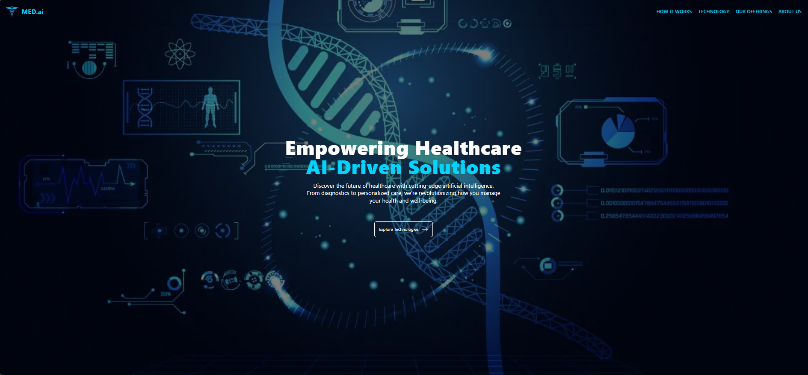
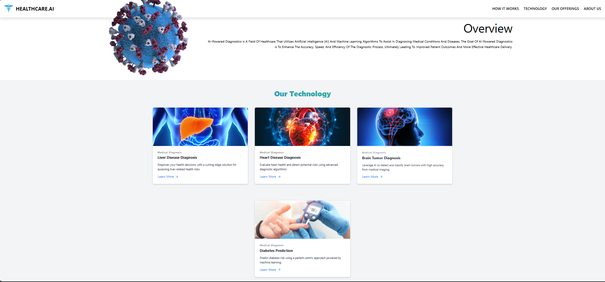

# **MedAI: AI-Driven Healthcare Diagnostics**

Our Track: **HEALTHCARE**

## **MedAI: AI-Powered Diagnostic System**

MedAI is an innovative AI-powered diagnostic system aimed at revolutionizing the medical field. Using cutting-edge artificial intelligence and machine learning algorithms, MedAI assists healthcare professionals in diagnosing medical conditions with increased accuracy, speed, and efficiency. By providing faster, more reliable results, MedAI enables healthcare providers to make informed decisions, improving patient care and outcomes.

### **Table of Contents**

- [About the Project](#about-the-project)
- [Getting Started](#getting-started)
- [Features](#features)
- [Installation](#installation)
- [Usage](#usage)
- [Contributing](#contributing)
- [Contact](#contact)
- [Team](#team)
- [Our Technology](#our-technology)

---

## **About the Project**

MedAI strives to tackle the complexities of medical diagnostics by harnessing the power of AI. With the ability to analyze vast amounts of medical data, MedAI helps clinicians diagnose diseases, identify conditions, and provide treatment recommendations more quickly and accurately. This system is designed to be a valuable assistant to medical professionals, ensuring better and more timely care for patients.


*AI-Powered Diagnostics at Work*


---

## **Getting Started**

To get MedAI up and running, follow the instructions below:

1. Ensure that you have Python 3.7 or higher installed on your machine.
2. Clone this repository to your local system.
3. Open a terminal and navigate to the project directory.
4. Set up a virtual environment with the following commands:
   ```bash
   pip install virtualenv
   virtualenv env
   ```

Activate the virtual environment (Windows PowerShell):
```bash

.\env\Scripts\Activate
```
Install the necessary packages:
```bash

pip install flask flask_cors

```
Start the application:

```bash

python app.py

```
Access the app by opening the following URL in your browser:
https://healthcare-ai-p5ax-evn8tf0lw-dev-spd.vercel.app/
Features
AI-Assisted Medical Diagnostics: Leveraging machine learning algorithms for accurate disease detection.
Speed & Accuracy: Providing quick, reliable results for timely decision-making.
User-Friendly Interface: Designed for seamless interaction with medical professionals.
Real-Time Data Analysis: Analyzing patient data in real-time for instant diagnostics.
Installation
Detailed instructions on setting up the application can be found in the Getting Started section.

Usage
Open your browser and visit http://localhost:5000.
Upload medical data or input patient symptoms.
Receive AI-powered diagnostic insights instantly.
Contributing
We encourage contributions to MedAI. If you'd like to help improve this project, please follow these steps:

Fork the repository to your own GitHub account.
Create a new branch: git checkout -b feature-name.
Commit your changes: git commit -m "Description of changes".
Push your changes: git push origin feature-name.
Open a pull request on GitHub.
Contact
For any questions or feedback, feel free to reach out. We'd love to hear from you!

## Team

MedAI was built by a dedicated team focused on transforming the healthcare industry through AI-powered diagnostics.

Vansh Ahuja: Full Stack Developer & AI Enthusiast


Pooja Devrari: Web Developer & Frontend Specialist


Meet the Team Behind MedAI

## Our Technology

MedAI utilizes a range of advanced technologies to deliver efficient and reliable diagnostics. From machine learning models to real-time data analysis, our platform is designed to transform the healthcare landscape.

